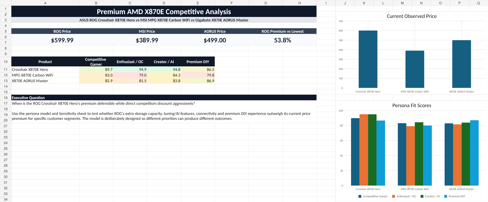

# Premium AMD X870E Competitive Analysis

A transparent product-positioning model comparing the **ASUS ROG Crosshair X870E Hero**, **MSI MPG X870E Carbon WiFi**, and **Gigabyte X870E AORUS Master** across six decision dimensions, four buyer personas, and four ROG price scenarios.

The model is designed to answer a product-management question—not to manufacture a universal winner:

> When is the ROG Crosshair X870E Hero's premium defensible while direct competitors discount aggressively?

[View the recruiter-facing Froghaus case study](https://froghausstudios.com/projects/x870e-competitive-analysis)



## Executive takeaways

| Finding | Evidence from workbook v1 |
|---|---|
| ROG has the strongest modeled fit for performance-led segments | 94.9 Enthusiast / OC and 94.8 Creator / AI |
| MSI creates the sharpest value challenge | $389.99 observed promotion versus $599.99 ROG direct price |
| AORUS prevents a universal-winner narrative | 86.9 Premium DIY versus 86.5 for ROG |
| ROG's premium is segment-dependent | Best defended where storage, dual networking, and tuning depth matter together |

Prices were captured on **September 22, 2026** and can change quickly. Refresh them before using this analysis in a presentation or interview.

## Project artifacts

- [Download the Excel model](workbook/x870e-product-competitive-analysis-v1.xlsx)
- [Read the methodology](METHODOLOGY.md)
- [Review normalized product data](data/product-data.csv)
- [Review persona scores](data/persona-scores.csv)
- [Review price-sensitivity scenarios](data/price-sensitivity.csv)
- [Audit the source register](sources/sources.csv)
- [Executive brief status](docs/executive-brief.md)

## Model scope

The workbook scores each product across:

1. Performance / overclocking
2. Expansion
3. Connectivity
4. DIY experience
5. Software / AI
6. Price / value

Four persona weight sets then translate those category scores into customer-specific fit:

- Competitive Gamer
- Enthusiast / Overclocker
- Creator / AI Developer
- Premium DIY Builder

## Repository structure

```text
assets/       Dashboard preview
data/         Portable CSV extracts from the workbook
docs/         Executive-brief release status
sources/      Source register with capture date and use
workbook/     Downloadable Excel model
```

## Interpretation boundary

This is a **positioning model**, not a laboratory benchmark, reliability ranking, or recommendation for every buyer. Feature counts are explicit proxies rather than direct measures of implementation quality. The comparison is bounded to the three products and the observed prices captured in workbook v1.

## Version

**v1.0 — September 22, 2026**

Built by [Nicholas Marnocha / Froghaus Studios](https://froghausstudios.com/).

